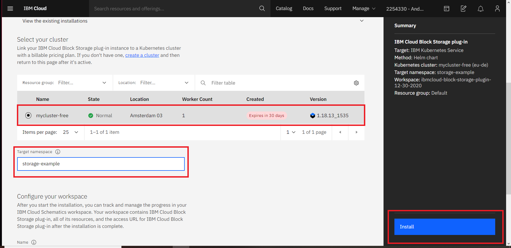
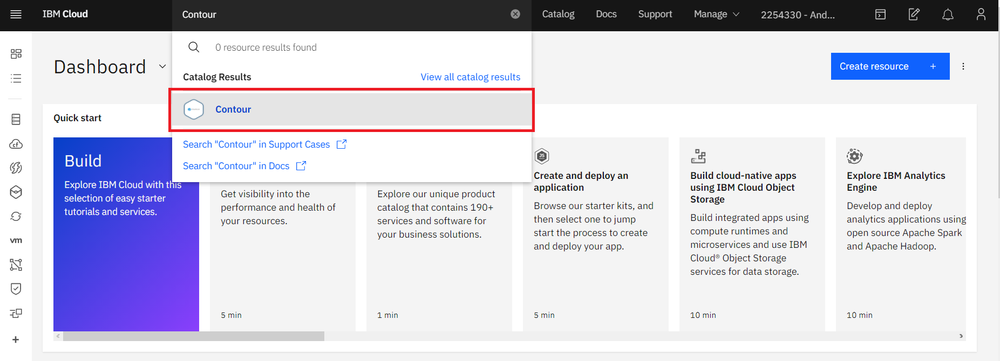
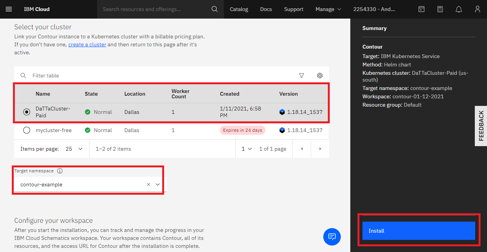
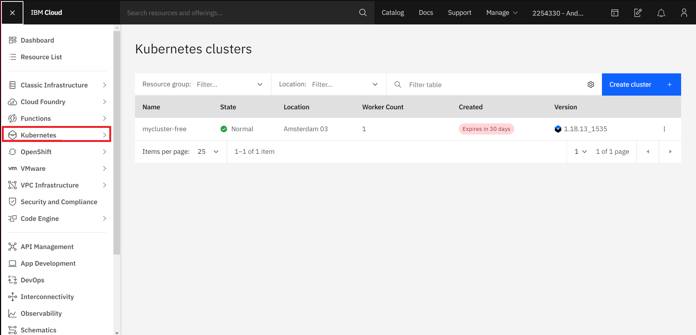
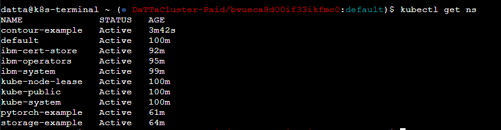
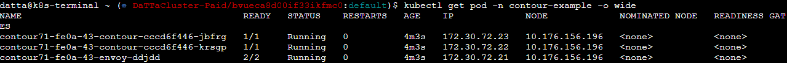
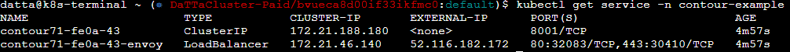

# Install Contour in IBM Cloud

## Pre-requisites
You must have an account created in IBM cloud, the account must be *Pay-As-You-Go* or *Subscription*. You can read more, [here](https://cloud.ibm.com/docs/account?topic=account-accounts "here").
If you have a Lite account, you can upgrade it, see [this](https://cloud.ibm.com/docs/account?topic=account-account-getting-started#account-gs-upgrade "this").

## Step 1: Provision Kubernetes Cluster

* Click on the search section at the top of the main page, type Kubernetes and choose Kurbenetes cluster

* A new window opens, in "Pricing plan", you can choose between the free and standard type, in this example we choose the free plan, and click on create.

* We wait a few minutes, when the cluster is ready the following ad appears.

## Step 2:  Deploy IBM Cloud Block Storage plug-in

* Click on the search section at the top of the main page, IBM cloud block storage and click it.

* A new window opens,select the cluster and put the name you want to the workspace in this case it will be called _storage-example_, we click on *Install* and wait a few minutes.

## Step 3: Install Contour

* Click on the search section at the top of the main page, type contour and choose it.

* A new window opens, select the cluster and put the name you want to the workspace, in this case it will be called _contour-example_, accept the terms and click on *Install*. You can modify the different installation parameters at the bottom, in our example we will leave them default, you can read more about the parameters [here](https://cloud.ibm.com/catalog/content/contour-Qml0bmFtaS1jb250b3Vy-global#about "here").

## Step 4: Verify Installation

* Go to the *Resources List* in the Left Navigation Menu and click on *Kubernetes*

* Click the *Actions* button and select *Web terminal*.

* A window opens to install the web terminal, click install and wait a few minutes.

* When the terminal is installed, click on the action button again and click on web terminal and type the following command. It will show you the workspaces of your cluster, you can see *contour-example* active.

`$ kubectl get ns`

`$ kubectl get pod -n contour-example -o wide`

`kubectl get service -n contour-example`

You have finished the installation, enjoy!

